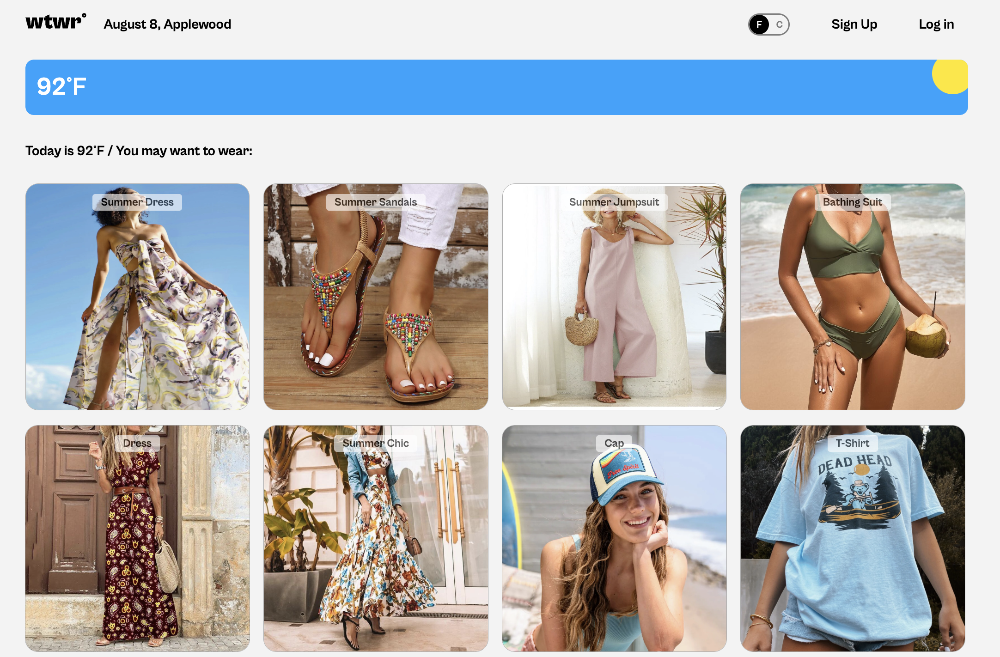
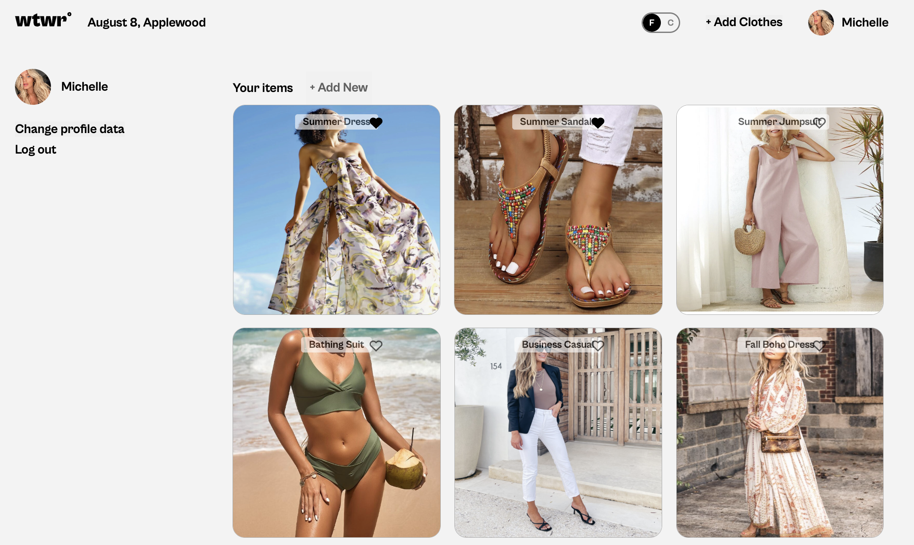

# WTWR (What to Wear?): Front End

_A weather-smart wardrobe assistant with a modern, responsive interface._

---

## Table of Contents

- [Live Project](#live-project)
- [Introduction](#introduction)
- [Project Goals](#project-goals)
- [Features](#features)
- [Tech Stack](#tech-stack)
- [What Was Done](#what-was-done)
- [Screenshots](#screenshots)
- [Installation & Setup](#installation--setup)
- [Development Scripts](#development-scripts)
- [Project Structure](#project-structure)
- [API Integration](#api-integration)
- [Future Improvements](#future-improvements)
- [Conclusion](#conclusion)

---

## Live Project

**Domain:** [https://www.wtwr.moonangel.com/](https://www.wtwr.moonangel.com/)  
**Back-End Repository:** [https://github.com/michelleoco/se_project_express](https://github.com/michelleoco/se_project_express)

---

## Introduction

**What To Wear (WTWR)** is a **full-stack web application** that reads weather data from an external Weather API and recommends suitable clothing to the user based on the conditions.

This repository contains the **React.js + Vite front end**, which provides the interactive interface for managing wardrobe items, displaying live weather, and receiving personalized outfit suggestions.

---

## Project Goals

- Create a clean, responsive, and intuitive front-end experience for WTWR users
- Display weather data in real time and tailor outfit suggestions accordingly
- Allow authenticated users to manage a personal wardrobe with full CRUD operations
- Ensure smooth integration with the back-end API
- Implement secure user authentication and authorization

---

## Features

- **User Authentication**
  - User registration and login
  - JWT-based authentication
  - Protected routes for authenticated users
  - Profile management with avatar support
- **Wardrobe Management**
  - Add new clothing items with images and weather categories
  - View all clothing items in a personal wardrobe
  - Delete clothing items with confirmation modal
  - Like/unlike clothing items
- **Weather Integration**
  - Live weather display based on coordinates
  - Dynamic weather icons for day/night conditions
  - Temperature display in Fahrenheit and Celsius
  - Weather-based clothing recommendations
- **User Interface**
  - Responsive design for desktop and mobile
  - Modal-based interactions for forms and confirmations
  - Toggle switch for temperature units
  - Form validation with instant feedback
- **Performance**
  - Fast builds and hot reloading with Vite
  - Optimized asset loading

---

## Tech Stack

- **Design & Prototyping:** Figma
- **Frontend Framework:** React.js 18.3.1
- **Build Tool:** Vite 5.3.1
- **Routing:** React Router DOM 6.30.0
- **Styling:** CSS3 with BEM methodology
- **Language:** JavaScript (ES6+)
- **Development Environment:** Node.js
- **Package Management:** npm
- **External APIs:**
  - OpenWeatherMap API for weather data
  - Custom WTWR backend API for user and clothing data

---

## What Was Done

The front end was built with **React.js** using Vite for a fast development experience and optimized builds.

Key development phases included:

1. **UI/UX Development**

   - Designed layouts and interactions in **Figma**
   - Implemented responsive design for desktop and mobile devices
   - Created reusable component architecture

2. **API Integration**

   - Connected to OpenWeatherMap API for real-time weather data
   - Integrated with custom WTWR back-end API for:
     - User authentication (signup/signin)
     - CRUD operations for clothing items
     - User profile management
     - Like/unlike functionality

3. **Routing & State Management**

   - Implemented client-side routing with **React Router**
   - Used React hooks (useState, useEffect, useContext) for state management
   - Created protected routes for authenticated users
   - Implemented context providers for global state (user, temperature unit)

4. **Authentication & Security**

   - JWT token-based authentication
   - Secure token storage in localStorage
   - Automatic token validation on app load
   - Protected route components

5. **Styling & Organization**
   - Used **CSS** with **BEM methodology** for maintainable styles
   - Organized components with co-located CSS files
   - Implemented responsive design patterns

---

## Screenshots

**Homepage (Weather & Recommendations)**  


**Wardrobe Management Page (Profile)**  


---

## Installation & Setup

**Requirements:**

- Node.js ≥ 18
- npm ≥ 9.0

**Installation:**

```bash
git clone https://github.com/michelleoco/se_project_react.git
cd se_project_react
npm install
```

**Environment Setup:**
The application automatically detects the environment and uses appropriate API endpoints:

- **Development:** `http://localhost:3001` (local backend)
- **Production:** `https://api.wtwr.moonangel.com` (deployed backend)

---

## Development Scripts

```bash
# Start development server with hot reload
npm run dev

# Build for production
npm run build

# Preview production build locally
npm run preview

# Run ESLint for code quality
npm run lint

# Deploy to production (custom script)
npm run deploy
```

---

## Project Structure

```
src/
├── components/          # React components
│   ├── App/            # Main application component
│   ├── Header/         # Navigation header
│   ├── Main/           # Homepage layout
│   ├── Profile/        # User profile page
│   ├── ItemCard/       # Clothing item display
│   ├── ItemModal/      # Item detail modal
│   ├── AddItemModal/   # Add new item form
│   ├── LoginModal/     # User login form
│   ├── RegisterModal/  # User registration form
│   └── ...
├── contexts/           # React context providers
├── utils/              # Utility functions and API calls
│   ├── api.js         # Backend API functions
│   ├── auth.js        # Authentication functions
│   ├── weatherApi.js  # Weather API functions
│   └── constants.js   # Application constants
└── assets/            # Static assets (images, icons)
```

---

## API Integration

The application integrates with two main APIs:

1. **OpenWeatherMap API**

   - Fetches real-time weather data
   - Provides temperature, conditions, and day/night status
   - Used for weather-based clothing recommendations

2. **WTWR Backend API**
   - User authentication and management
   - CRUD operations for clothing items
   - Like/unlike functionality
   - Profile management

---

## Future Improvements

- **Enhanced User Experience**
  - Add drag-and-drop functionality for wardrobe item organization
  - Implement dark mode for better accessibility
  - Add clothing item categories and filtering
- **Performance Optimizations**
  - Implement lazy loading for images to improve mobile performance
  - Add image compression and optimization
  - Implement caching strategies for API calls
- **Additional Features**
  - Weather forecast integration (multi-day predictions)
  - Outfit combination suggestions
  - Social features (sharing outfits)
  - Push notifications for weather changes

---

## Conclusion

The WTWR front end delivers a comprehensive weather-based wardrobe management experience with:

- A clean, modern, and responsive interface
- Real-time outfit recommendations based on live weather data
- Secure user authentication and personalized wardrobe management
- Smooth integration with the backend for a complete full-stack experience
- Scalable architecture built with modern React patterns and best practices

The application successfully combines weather data with personal wardrobe management to provide users with practical, weather-appropriate clothing recommendations.
